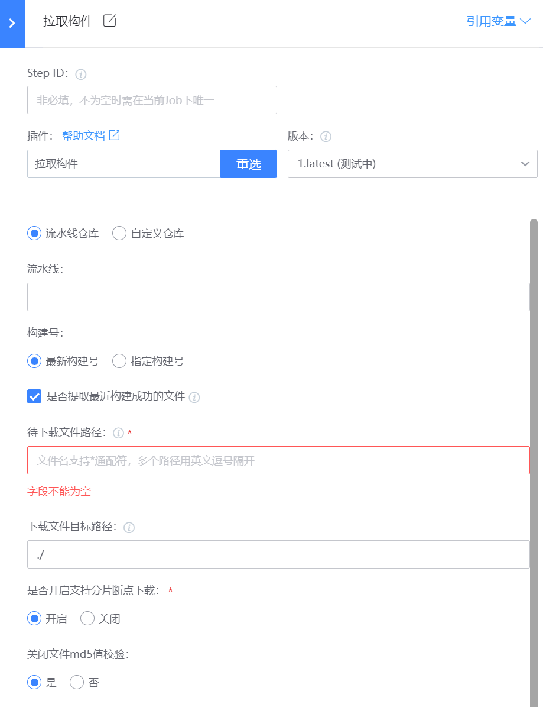

# 拉取构件
将制品库中的文件拉取到构建机上，支持拉取流水线仓库或自定义仓库

## 使用指南
### 一、新增插件
在蓝盾的研发商店->工作台->新增插件 页面

各字段值填写如下:

名称: 拉取构件（这个可以自定义)

标识: downloadArtifact

调试项目: 选择自己的项目

开发语言: java

自定义前端: 否

### 二、发布管理
新增插件后，就会跳转到插件发布管理界面,点击"上架”

### 三、上架插件
步骤:

1.上传插件图标,插件图标可以直接使用[downloadArtifact](images/downloadArtifact.png)

2.插件job类型,linux、macos、windows都选上

3.上传插件包，插件包从[releases](https://github.com/TencentBlueKing/ci-downloadArtifact/releases)下载最新版本插件zip包

4.填写发布日志

### 四、配置插件
当插件上架后，就可以在流水线中选择插件，插件配置如下:

- 拉取仓库(repoName): 流水线仓库(pipeline)或自定义仓库(custom)
- 流水线(targetPipelineId): 仓库为流水线仓库时必填，选择流水线或输入流水线id
- 构建号(latestBuildNum): 仓库为流水线仓库时必填, 最新构建号为true，指定构建号为false
- 是否提取最近构建成功的文件(isSuccessfulBuild): 构建号为最新构建号时填写
- 指定构建号(buildNum): 构建号为指定构建号时必填，选择或输入构建号
- 待下载文件路径(srcPaths): 文件名支持*通配符，多个路径用英文逗号隔开。流水线仓库只需要填写文件名，例如artifact.zip；自定义仓库需要填写文件完整路径，例如/release/artifact.zip
- 下载文件目录路径(destPath): 下载到本地的路径，只支持相对路径，前面默认拼接工作空间
- 是否开启分片断点下载(rangeDownload): 开启后分片下载文件
- 关闭文件md5值校验(ignoreDigestCheck): 开启分片断点下载后选填，关闭后下载完成后不校验md5
